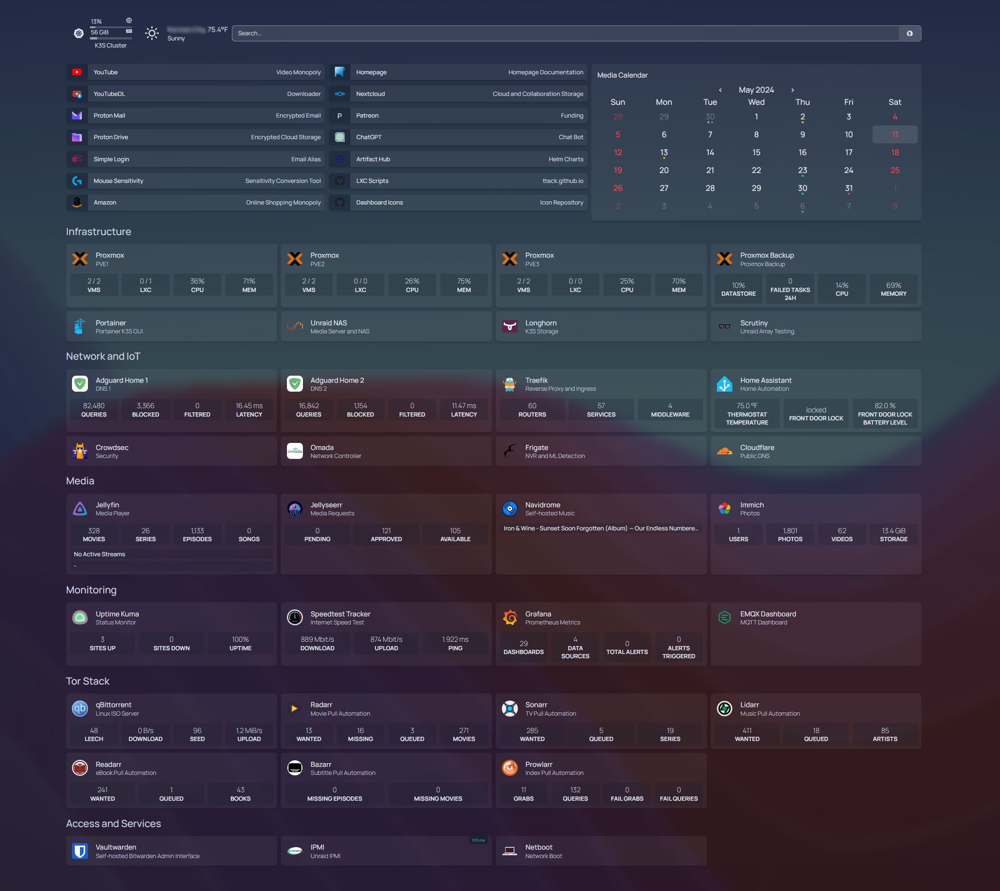

**Homepage Configuration With Docker and Kubernetes Deployment Files**

A full run-down of my Homepage dashboard configuration as well as my specific Kubernetes deployment of it.
When using Kubernetes I combined all of Homepage's YAML configuration files into a ConfigMap.
For all who are not using Kubernetes, I included a "configuration" folder where you can find the specific YAML per file. If you prefer to use Docker or an LXC container, or you want to map files to volumes without a ConfigMap, feel free to pull from the configuration folder.

When Homepage releases new features and/or widgets I take advantage of, I will be sure to update this and release the necessary changes.

Much of this was built ontop of configuration provided by [techno-tim](https://github.com/techno-tim) and his [YouTube video](https://youtu.be/mC3tjysJ01E?si=O5Pk5-9jzgyePVJL) on Homepage. Do go check his channel out. It is a wonderful resource.

Hopefully this serves useful!

# Configuration Result:

